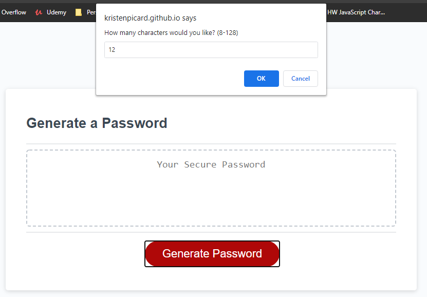
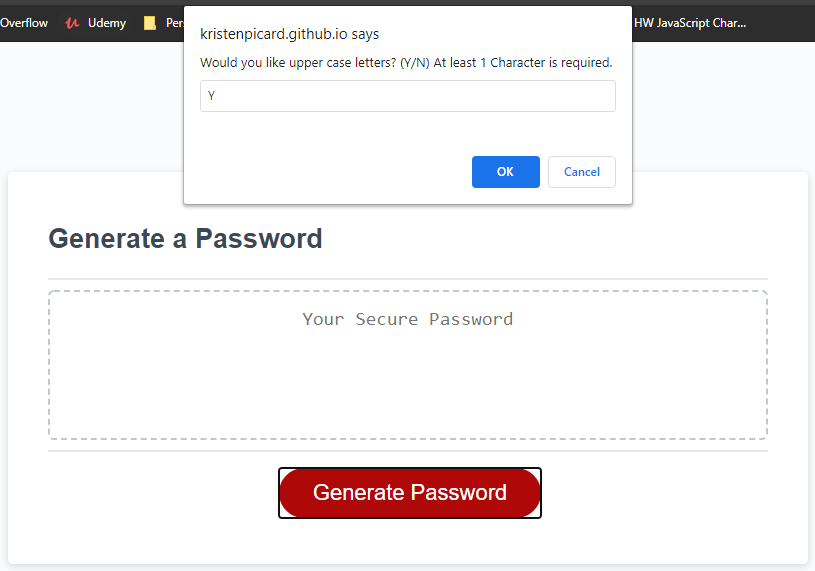
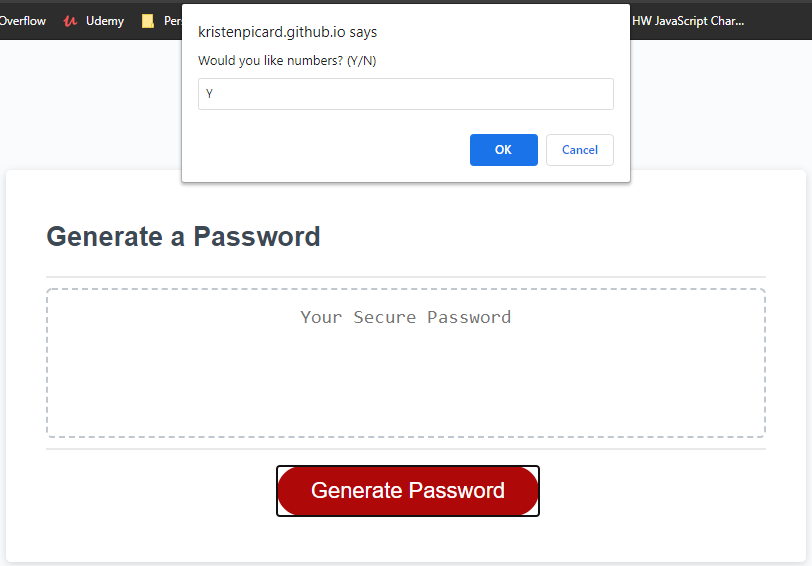
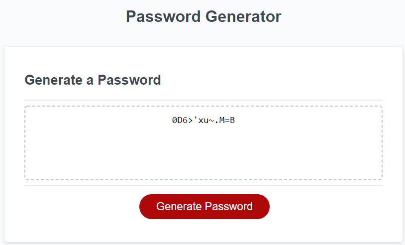

# Password Generator

https://kristenpicard.github.io/Password-Generator/

## Description 

In this project I wanted to create a password generator.  
I wanted to prompt the user to select various inputs for their desired resulting password.
I set the length of the password to be between 8 and 128 characters.
I gave the user the option of whether or not they want to include special characters in their password.
I gave the user the option of whether or not they want to include numbers in their password.
I require the password to include letters but give the user the option of whether or not they wat to include upper case letters in their password. 
Once all of the user prompts are answered, then the password is displayed.

Here is what the user sees when they click the generate button the first time:
 

Here are examples of each of the various prompts:
 

 

 

 

 
Finally, here is an example of a finished password:
 

